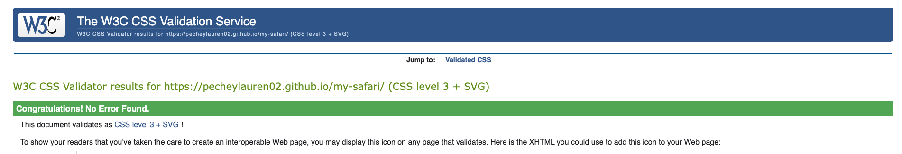
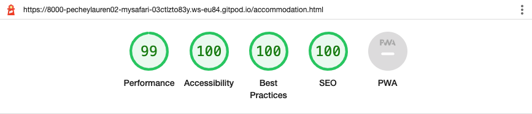
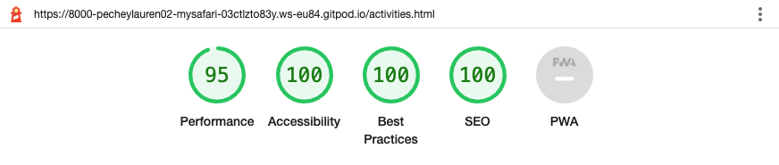
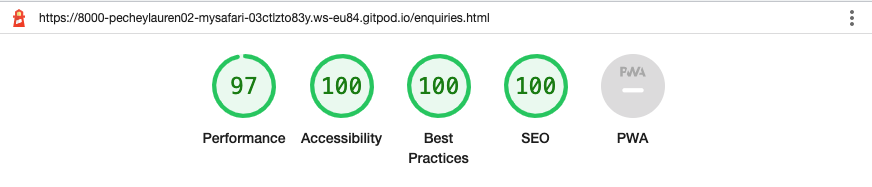
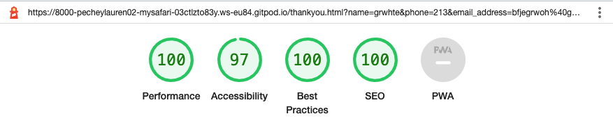

# Sable Safari Website

- Add image here of three screens 

#### By Lauren Pechey
[Click here to view the live web application](https://pecheylauren02.github.io/my-safari/index.html)

#### HELLO EVERYONE!

This is the documentation for a new and upcoming Safari website, called Sable Safari! It has been built using HTML5 & CSS3 as an educational Project offered as part of Code Institute’s Diploma in Full Stack Software Development.

## Table of Contents

1. [Project Development and Planning](#project-development--planning)
    - [Project Goals](#project-goals)
        - [Project Purpose](#project-purpose)
        - [Target Audience](#target-audience)
    - [Research](#research)
        - [Market Review](#market-review)
        - [Key Takeaways](#key-takeaways-from-market-review)
    - [User Stories](#user-stories)
    - [Design, Layout and Structure](#design-layout--structure)
        - [Wireframes](#wireframes)
        - [Structure](#structure)
        - [Colour](#colour)
        - [Font](#font)
        - [Imagery](#imagery)
2. [Technologies Used](#technologies-used)
    - [Languages](#languages)
    - [Tools](#tools)
3. [Features](#features)
    - [Whole Site](#whole-site)
        - [Nav Bar and Header](#whole-site)
        - [Hero Image](#hero)
        - [Footer](#footer)
        - [Favicon](#favicon)
    - [About Us page](#about-us-page)
        - [Bio & Find Out More Button](#bio--find-out-more-button)
        - [Photo Gallery](#home-photo-gallery)
        - [Video](#video)
    - [Accommodation page](#accommodation-page)
        - [About Us Sections](#about-us-sections)
        - [Call To Action](#call-to-action)
    - [Activities page](#book-us)
        - [Book Us Info & Form](#book-us-info--form)
        - [Testimonials](#testimonials)
    - [Enquiries page](#enquiries-page)
        - [Join Us Info & Form](#join-us-info--form)
        - [Photo Gallery](#join-photo-gallery)
    - [Other Pages](#other-pages)
        - [Thankyou Page](#thankyou-page)
    - [Future Features](#future-features)
- [Testing and bugs](#testing--bugs)
    - [HTML Validator Testing](#html-validator-testing)
    - [CSS Validator Testing](#css-validator-testing)
    - [Accessibility](#accessibility)
    - [Performance](#performance)
    - [Responsiveness / Device Testing](#responsiveness--device-testing)
    - [Browser Compatibility](#browser-compatibility)
    - [Bugs & Fixes](#bugs--fixes)
    - [Testing User Stories](#testing-user-stories)
- [Deployment](#deployment)
- [Credits](#credits)

## Project Development and Planning 

The planning and development of this website was done using principles of User Experience (UX) design, which include the five planes of Strategy, Scope, Structure, Skeleton and Surface. With these principles in mind, the aim was to ensure an easy-to-use, responsive and eye-catching website to meet the goals and needs of potential clients interested in booking a Safari holiday.

### Project Goals 

#### Project Purpose

- The Sable Safari website is a site for tourists and local travellers looking to visit Zimbabwe and book an exciting safari getaway. 
- Sable Safari is a made-up Safari getaway which offers accommodation and activities to meet the needs of all types of travellers: from adrenaline-junkies to wildlife enthusiasts, and even people who simply want to relax and enjoy the African sunset. 
- The website was designed to be both eye-catching and easy-to-navigate, to provide the users with an informative, exciting and simple outline of what they can expect if they decide to visit Sable Safari.
- Users will be able to find general information about the Safari getaway, as well as the various activities they can indulge in upon arrival. They can also look at the types of rooms they'd like to stay in, and make enquiries through the enquiry form page. 

#### Target Audience

- Sable Safari is designed for users who are interested in booking a safari holiday in Zimbabwe, and offers easy-to-navigate pages to allow travellers to get a feel of what is offered. 
- The simplicity of the website makes it easy for adults, teenagers and even children to explore what is offered and what they can participate in upon arrival.

#### User Goals 
- To have a professional, bold and welcoming appearance, to attract travellers who may be interested in booking a Safari holiday. 
- To share information about what is offered at Sable Safari, including general information, accommodation and activities. 
- To give users the opportunity to ask questions through a simply enquiry form. 
- To allow users to navigate between pages with ease, and to keep the design and colour palette fairly consistent. 

## Research 

### Market Review 

Before designing the website, I reviewed the market by looking at other safari websites based in Zimbabwe and South Africa, in order to get a feel of how they presented themselves, which content and features they offered, and the design choices they made in terms of colour palette. I also reviewed what appeared to work well for the user and what needed improvements. 

[Victoria Falls Safari Lodge](https://victoria-falls-safari-lodge.com/) | [Zambezi Drift](https://www.zambezidrift.com/about-us/) | [Ilala Lodge](https://www.ilalalodge.com/) | [African Bush Camps](https://africanbushcamps.com/camps/bumi-hills-safari-lodge/) | [Bush Lovers Safari](https://www.bushloverssafari.co.za/)

### Key Takeaways from Market Review 
- The website should be eye-catching, to make travellers excited about booking with their chosen Safari
- The Website should be clean, simple and easy to navigate
- Hero images should be vibrant and relevant to the safari theme
- Images and video content are key features to advertise the safari well
- Navigation and social media links should be easily accessible 

## User Stories
- User Story 1: As someone interested in booking a holiday at Sable Safari I want to:
     - find out general information about the Safari and what they offer
     - see and listen to media content of what they offer
     - contact the administration if I have any questions or want to book
     - navigate easily between pages

- User Story 2: As a booking company on behalf of travellers I want to: 

- User Story 3:

These user stories gave me a clear scope for the website and enabled me to stay on track with the project, preventing scope issues at a later stage after the coding process. 

## Design, Layout and Structure 
The design, layout and structure was consistent across all pages for certain elements, such as the colour palette for headings, paragraphs and backgrounds, the design of the navigation bar and footer and the social links. However, the layout of each page was slightly different, to allow users to differentiate between different pages easily. On each page, I incorporated a lot of visual content, such as eye-catching images, bold colours and a video.

### Wireframes

I used [Balsamiq](https://balsamiq.com/) in the initial design phase, before the coding process. This enabled me to develop the website's structure, skeleton, layout and overall look and style.

About Us

Accommodation

Activities

Enquiry

### Structure

The structure of this website was informed by the principles of interactive design (IXD), the scope and the user and business goals of Sable Safari. These were all kept in mind to ensure that the website conformed to user's expectations and needs. 

The site is made of a simple, four page structure:
- About Us
     - Gives the users a brief introduction to Sable Safari, as well as a video of the infamous Victoria Falls, a summary of reasons to stay there, and some eye-catching images of up-close encounters with wildlife. 
- Accommodation
     - Shows the users the different rooms available, including pictures, information and prices. 
- Activities
     - Displays the four activities that travellers can engage in when they arrive at Sable Safari, using images side by side with information about each activity.
- Enquiry
     - Displays a simple, easy-to-fill-in form for users who have questions about Sable Safari, as well as more information to further attract users into booking. 

There is also a subpage:
- Thank you
     - The user will be brought here after submitting the enquiry form correctly. 

The site has a navigation bar which is consistent in design across all four pages, with the full page names (About Us, Accommodation, Activities, Enquiry) showing for desktop screens, and the relevant icons only showing for Ipad/Tablet and mobile screens. The navbar was reduced to icons to prevent it from taking up too much real estate on smaller screens and to give a cleaner appearance overall. The navbar allows users to access any page they need and is useful for both new and returning users. There is also a footer with consistent design across all four pages, to allow users to visit the social media sites of Sable Safari at any time, and to contact them should they wish to book a holiday or ask questions. 

On the About Us page, there is also another method of navigation, through the "Find out more" buttons directly below the "Why Stay With Us?" section. This allows users to immediately visit gain access to further information about either the accommodation or activities offered by Sable Safari. 

The suggested route is ABOUT US > ACCOMMODATION/ACTIVITIES > ENQUIRE

Screenshots

### Colour 

I chose to use a bright, bold design using safari-themed colours sunset shades of orange, white and black for effective contrasting and green to differentiate buttons, prices and copyright information from other content.

### Font

My choice of font was [Libre Baskerville](https://fonts.google.com/?query=baskerville) for all paragraphs and [Libre Baskerville Bold](https://fonts.google.com/specimen/Libre+Baskerville?query=baskerville) for all headings. Both font choices were imported from [Google Fonts](https://fonts.google.com/) and had a backup font of Sans Serif. I chose these fonts for my website because they both have an elegant, professional and welcoming finish which is best suited for a website aiming to attract its users. The boldness also displayed a strong legibility as headings over images, text and videos. 

### Imagery
In the top, left corner of each page, a Safari logo with paw icons on either side can be seen. Clicking it will direct the user back to the "About Us" page.

image here 

To illustrate the "About Us" Page, 

## Technologies Used 

This website used a combination of two different languages, and some web tools for the initial planning. A list of those included in the project can be seen as follows: 

### Languages 
- [HTML](https://en.wikipedia.org/wiki/HTML5)
- [CSS](https://en.wikipedia.org/wiki/Cascading_Style_Sheets)

### Tools 
- [Git](https://git-scm.com/)
    - Git was used for version control via GitPod, by using the terminal to Git and Push to GitHub.
- [GitHub](https://github.com/)
    - GitHub was used to store the project code after being created in GitPod/Git.
- [Gitpod](https://www.gitpod.io/)
    - Gitpod was used to create, edit and preview the project's code.
- [Balsamiq](https://balsamiq.com/)
     - Balsamiq was used to create wireframes during the initial design process.
- [Google Fonts](https://fonts.google.com/)
    - Google Fonts was used to select and import the fonts to the project (Libre Baskerville and Libre Baskerville Bold).
- [Font Awesome](https://fontawesome.com/)
    - Font Awesome was used to add icons to the site to help with UX and to add more character to the project visually.
- [Sirv](https://sirv.com/)
     - Sirv was used to organise images for the website, as well as optimise size and find the image source urls. 
- [I Love Img](https://www.iloveimg.com/resize-image)
     - This was used to optimise images by size.
- [Adobe Illustrator](https://www.adobe.com/uk/products/illustrator.html)
    - This was used to create the colour pallette as well as ideas for initial design.

## Features

### Whole Site

#### Navbar and Header

Screenshots

- The navbar features the Sable Safari logo identically at the top left-corner of each page, so that the user can immediately identify what the website is about.  
- There are also four navigation links identically placed to the right: "About Us", "Accommodation", "Activities" and "Enquire", to allow for easy navigation to the different pages of the website. 
     - The user can easily navigate through each page, without needing to use the 'back' button to revert to a previous page. 
- The page that the user is currently on differentiated by a bright orange border, to make it easy for users to see which page they are on. 
- When the user hovers over a navigation link, it changes colour from white to bright orange so the user can see which link they are about to click.
- The navbar is fully responsive, and the reduces to icons only for smaller screens like Ipads, tablets and mobiles. 

#### Hero

Screenshots

- Each main page displays a hero image of a close-up encounter with a wild animal you would expect to see at Sable Safari.
- The size of the hero images are large, with a small part of the next container visible to encourage the user to scroll further. 
- Each hero image has a gradient over it, to improve the legibility of the caption.
- Each hero image is responsive across all pages and screens, including the hero captions, making it accessible to all users.

#### Footer 
- The footer section is identical across all four pages, to provide the user with consistency and to allow them to find the Contact Information, regardless of which page they are on. 
- The footer uses the same colour scheme as the rest of the website for consistency, and is fixed at the bottom of each page. 
- The footer contains contact information such as Sable Safari's phone number and email address, as well as social links to all of the social media pages, which open in a new tab. 
     - It also shows Copyright information.
- The social links change from a soft orange colour to white when the user hovers over it, to show the user which link they are about to click. 
- This section will be valuable to the user because it encourages them to stay connected via call, email and social media. 
- The footer is responsive on all screens. 

Screenshots

### About Us page
 
#### The Welcome section

Screenshots

- The first section that the users sees after the hero image is a bright orange heading with a brief introduction to Sable Safari. 
- On larger screens, to the right of the welcome information is a video of Victoria Falls, an infamous landmark located near the Safari, that the users can watch to get a feel of the area. 
     - On smaller screens, the video is below the welcome information, to prevent the font-size being illegible due to shrinkage. 
- The embedded YouTube video player does not autoplay, so that user is not surprised or annoyed by a sudden video or audio. 
- The video is responsive on all screens, and has built in features such as play controls, a full-screen button and volume control. 
- The video shows Victoria Falls, a landmark near where Sable Safari would be located, rather than Sable Safari itself.
     - This is because Sable Safari does not exist in real-life. If Sable Safari was a real business, a video of the accommodation and activities offered would be more ideal.

#### The Photo Gallery

Screenshots

- Below the video is a photo gallery container, with a different colour background to the welcome container to differentiate between the two. 
- This section displays six close-up images of wildlife you might expect to see on a safari getaway. 
- The gallery is responsive on desktop and Ipad/tablet screen sizes, but is hidden on mobile screen sizes due to taking up too much real estate. 

 #### The "Why Stay With Us?" section
 

Screenshots

- This section gives the user four catchy, brief glimpses of what is offered at Sable Safari.
- Below each summary, there is a "Find out more" button, to encourage them to explore other aspects of the website like accommodation and activities. 
     - The "Find out more" button navigated the user to either the acccommodation or activities page, depending on which description they show interest in and click.
     - This button is designed with a bright green background colour with white font, to differentiate it from other elements like headings and paragraphs.
     - If the user hovers over the button, the text is underlined to show the user which button they are about to click. 

Screenshots

### Accommodation page

This page is separated into three sections: Luxury Rooms, Safari Lodges and Tented Campsites. 

Screenshots

- Each section is separated by a different background colour, from black to dark grey, so users can differentiate between the sections. 
- The design, layout and structure of each section is consistent: 
     - On large screens, the user can see a centered heading of the section, followed by three circled images of each room side by side across the screen.
     - Below each image is a brief description of the room. 
     - Below this information is the price per night, coloured in the same bright green as the buttons, to differentiate it from the text. 
     - On medium screens, such as Ipads and tablets, the structure shows two circled images side by side, and one below to allow for responsive design. 
     - On small screens, such as mobiles, the use can only see one circled image with text below it across the entire screen, again to allow for responsive design and prevent images from being too small for the user to see. 
- This layout provides a visually appealing aesthetic and makes it easy for the user to learn more about the variety of accommodation they can stay in. 

### Activities page
This page is separated into four sections: Safari Game Drives, White Water Rafting, Bungee Jumping and a Sunset Boat Cruise. 

Screenshots

- The layout shows an eye-catching image of the first type of activity on the left, and information about the activity on the right. 
- It then alternates with the second activity image being on the right, with its information on the left, and so on. 
- As per the accommodation page, each activity is differentiated by the background colour, which switches from black to dark grey. 
- Each description is separated into "What to expect" and "What to bring" so as not to overwhelm the user with too much text. 

### Enquiries page
This page shows two sections: an easy-to-fill-in enquiry form and some further information about Sable Safari. 

Screenshots

- On desktops, these sites sit side by side but stack on top of each other on smaller screens. 
- The enquiry form has the following features:
     - It requires the user to fill in basic details, such as their name, phone number and email address to make it easier for Sable Safari to keep in touch with them. 
     - It has a drop-down menu for the user to choose which accommodation they are interested in. 
     - It allows the user to choose how many people will be coming.
     - It has a message section for any general queries or concerns or to simply get in touch with Sable Safari. 
     - All of the features have placeholder text to make it clear the information required to fill in the form. 
     - The form will not submit unless the information is put in correctly, e.g. if the user puts letters in the phone section instead of numbers. 
     - It has a "Send" button which is in bright green to match the style of other buttons. The user will be taken to a "Thank You" page provided they fill in the form correctly. 
- There is also some further information called "Why Sable Safari?" to consolidate what the user has already read throughout the website. 

## Future Features 
- Video of Sable Safari
- More interactions

## Testing and Bugs

### HTML Validator Testing 

### CSS Validator Testing

I ran my CSS code through the [W3C CSS Validator](https://jigsaw.w3.org/css-validator/). No errors were displayed. 

Screenshots

### Accessibility

I tested accessibility of the website using Google Chrome Dev Tools Lighthouse, and the scores came out clean.

About Us

Accommodation

Activities

Enquire

Thankyou

### Performance

I tested the side through Google Chrome Dev Tools Lighthouse to check on the performance. The scores showed high on all pages, but needed improvement for the "About Us" page. This page was delayed in performance due to the size of the hero image. Once that was resized using [TinyPNG](https://www.tinypng.com) the performance was higher. 

About Us

Accommodation

Activities

Enquire

Thankyou

### Browser Compatibility

The site was tested on the following browsers

- Google Chrome
- Mozilla Firefox
- Apple Safari

There were no issues on Chrome and Firefox but the footer on Safari was covering the content, which was an issue. [Here is how it was fixed:](#footer-covering-content-on-safari)

### Responsiveness/Device Testing

The website was tested on the following devices:
- HP Display 27-inch External Monitor
- Apple Macbook Pro 13-inch
- Samsung Galaxy S10
- Apple iPhone SE
- Apple iPad mini
- Galaxy Tablet
- Google Chrome Developer Tools - using responsive testing for all screen sizes

The website functioned as expected on all devices.

### Solved Bugs

#### Footer Covering Content on Safari

## Deployment

### GitHub Pages 

The site was deployed to GitHub Pages, using the following steps:
1. In the GitHub repository, navigate to the Settings tab.
2. From the menu on the left, select 'Pages'.
3. From the source option, select Branch: main.
4. Click 'Save'.
5. A live link will be displayed when published successfully.

[You can find the live link here](https://pecheylauren02.github.io/my-safari/)

### Forking the GitHub Repsoitory

To fork the repository you can follow these steps:
1. Go to the GitHub repository
2. Click on Fork button in upper right hand corner

### Cloning the GitHub Repository

To clone the repository to use locally, you can follow these steps:

1. Navigate to the GitHub Repository you want to clone
2. Click on the code drop down button
3. Click on HTTPS
4. Copy the repository link to the clipboard
5. Open your IDE of choice (git must be installed for the next steps)
6. Type git clone copied-git-url into the IDE terminal

The project will now be cloned locally for your use. 

## Credits

### Code

- [Foolish Developer](https://foolishdeveloper.com/simple-responsive-footer-design-using-html-and-css/) helped in styling the footer to be responsive on all screens. 
- [W3C Schools](https://www.w3schools.com/howto/howto_css_navbar_icon.asp) helped me to style the navigation bar with icons.
- [W3C Schools](https://www.w3schools.com/howto/howto_css_images_side_by_side.asp) helped with positioning the gallery images side by side. 
- [Heap Coding](https://www.heapcoding.com/how-to-put-image-and-text-side-by-side-in-html/) helped with the positioning of images alongside text for the Activities page. 

### Media

#### Images
- About Us page
     - Hero image [Pexels website]()
     - Photo Gallery
          - Giraffe Photo [Pexels website](https://images.pexels.com/photos/1382156/pexels-photo-1382156.jpeg?auto=compress&cs=tinysrgb&w=1600)
          - Impala Photo [Pexels website](https://images.pexels.com/photos/1109899/pexels-photo-1109899.jpeg?auto=compress&cs=tinysrgb&w=1260&h=750&dpr=1)
          - Leopard Photo [Pexels website](https://images.pexels.com/photos/46254/leopard-wildcat-big-cat-botswana-46254.jpeg)
          - Elephant Photo [Pexels website](https://images.pexels.com/photos/1054666/pexels-photo-1054666.jpeg?auto=compress&cs=tinysrgb&w=1260&h=750&dpr=1)
          - Lion Photo [Pexels website](https://images.pexels.com/photos/4032590/pexels-photo-4032590.jpeg?auto=compress&cs=tinysrgb&w=1260&h=750&dpr=1)
          - Zebra Photo [Pexels website](https://images.pexels.com/photos/763925/pexels-photo-763925.jpeg?auto=compress&cs=tinysrgb&w=1260&h=750&dpr=1)

- Accommodation page
     - Hero image [Pexels website]()
     - Accommodation photos
          - Presidential Suite [Pexels website](https://images.pexels.com/photos/3701434/pexels-photo-3701434.jpeg?auto=compress&cs=tinysrgb&w=1600)
          - Honeymoon Suite [Pexels website](https://images.pexels.com/photos/1579253/pexels-photo-1579253.jpeg?auto=compress&cs=tinysrgb&w=1260&h=750&dpr=1)
          - Deluxe Room [Pexels website](https://images.pexels.com/photos/271624/pexels-photo-271624.jpeg?auto=compress&cs=tinysrgb&w=1260&h=750&dpr=1)
          - Nyati Lodge [Pexels website](https://images.pexels.com/photos/5784432/pexels-photo-5784432.jpeg?auto=compress&cs=tinysrgb&w=1260&h=750&dpr=1)
          - Nzou Lodge [Pexels website](https://images.pexels.com/photos/5439495/pexels-photo-5439495.jpeg?auto=compress&cs=tinysrgb&w=1260&h=750&dpr=1)
          - Ingwe Lodge [Pexels website](https://images.pexels.com/photos/5439496/pexels-photo-5439496.jpeg?auto=compress&cs=tinysrgb&w=1260&h=750&dpr=1)
          - Campsite One [Pexels website]()
          - Campsite Two [Pexels website]()
          - Campsite Three [Pexels website]()
          
- Activities page
     - Hero image [Pexels website](https://images.pexels.com/photos/39504/giraffe-animal-funny-facial-expression-39504.jpeg?auto=compress&cs=tinysrgb&w=1600)
     - Activities photos
          - Safari Game Drive Photo [Pexels website]()
          - Bungee Jumping Photo [Pexels website]()
          - White Water Rafting Photo [Pexels website]()
          - Boat Sunset Cruise Photo [Pexels website]()

- Enquire page
     - Hero image [Pexels website](https://images.pexels.com/photos/561870/pexels-photo-561870.jpeg?auto=compress&cs=tinysrgb&w=1600)

#### Video 
- A video of the infamous Victoria Falls: [Soar Above Victoria Falls](https://www.youtube.com/watch?v=_EKLcgECxrM&t=8s)

### Acknowledgements 

- My mentor, Rohit Sharma, for all of his advice and support throughout the project.
- Tutor Support at [Code Institute](https://codeinstitute.net/) for their teaching and support on important coding issues. 

