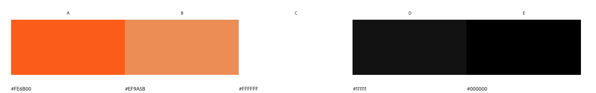

# Sable Safari Website

- Add image here of three screens 

#### By Lauren Pechey
[Click here to view the live web application](https://pecheylauren02.github.io/my-safari/index.html)

#### HELLO EVERYONE!

This is the documentation for a new and upcoming Safari website, called Sable Safari! It has been built using HTML5 & CSS3 as an educational Project offered as part of Code Institute’s Diploma in Full Stack Software Development.

## Table of Contents

1. [Project Development and Planning](#project-development--planning)
    * [Project Goals](#project-goals)
        * [Project Purpose](#project-purpose)
        * [Target Audience](#target-audience)
    * [Research](#research)
        * [Market Review](#market-review)
        * [Key Takeaways](#key-takeaways-from-market-review)
    * [User Stories](#user-stories)
    * [Design, Layout & Structure](#design-layout--structure)
        * [Wireframes](#wireframes)
        * [Structure](#structure)
        * [Colour](#colour)
        * [Fonts](#fonts)
2. [Technologies Used](#technologies-used)
    * [Languages](#languages)
    * [Tools](#tools)

## Project Development and Planning 

The planning and development of this website was done using principles of User Experience (UX) design, which include the five planes of Strategy, Scope, Structure, Skeleton and Surface. With these principles in mind, the aim was to ensure an easy-to-use, responsive and eye-catching website to meet the goals and needs of potential clients. 

### Project Goals 

- #### Project Purpose

     - The Sable Safari website is a site for tourists and local travellers looking to visit Zimbabwe and book an exciting safari getaway. Sable Safari offers accommodation and activities to meet the needs of all types of traveller: from adrenaline-junkies to wildlife enthusiasts, and even people who simply want to relax and enjoy the african sunset. 

     - Users will be able to find general information about the Safari getaway, as well as the various activities they can indulge in upon arrival. They can also look at the types of rooms they'd like to stay in, and make enquiries through the enquiry form page. 

- #### Target Audience

     - Sable Safari is designed for users who are interested in booking a safari holiday in Zimbabwe, and offers easy-to-navigate pages to allow travellers to get a feel of what is offered. 

## Research 

### Market Review 

Before designing the website, I reviewed the market by looking at other safari websites based in Zimbabwe and South Africa, in order to get a feel of how they presented themselves, which content and features they offered, and the design choices they made in terms of colour palette. I also reviewed what appeared to work well for the user and what needed improvements. 

[Victoria Falls Safari Lodge](https://victoria-falls-safari-lodge.com/) | [Zambezi Drift](https://www.zambezidrift.com/about-us/) | [Ilala Lodge](https://www.ilalalodge.com/) | [African Bush Camps](https://africanbushcamps.com/camps/bumi-hills-safari-lodge/) | [Bush Lovers Safari](https://www.bushloverssafari.co.za/)

### Key Takeaways from Market Review 
- The website should be eye-catching, to make travellers excited about booking with their chosen Safari
- The Website should be clean, simple and easy to navigate
- Hero images should be vibrant and relevant to the safari theme
- Images and video content are key features to advertise the safari well
- Navigation and social media links should be easily accessible 

## User Stories
- User Story 1: As someone interested in booking a holiday at Sable Safari I want to:
     - find out general information about the Safari and what they offer
     - see and listen to media content of what they offer
     - contact the administration if I have any questions or want to book
     - navigate easily between pages

- User Story 2: As a booking company on behalf of travellers I want to: 

- User Story 3:

These user stories gave me a clear scope for the website and enabled me to stay on track with the project, preventing scope issues at a later stage after the coding process. 

## Design, Layout and Structure 
I incorporated lots of visual content, such as eye-catching images.

### Wireframes

I used [Balsamiq](https://balsamiq.com/) in the initial design phase, before the coding process. This enabled me to develop the website's structure, skeleton, layout and overall look and style.

### Structure

### Colour 

I chose to use a bright, bold design using safari-themed colours sunset shades of orange, white and black for effective contrasting and green to differentiate buttons, prices and copyright information from other content.

### Font

My choice of font was [Libre Baskerville](https://fonts.google.com/?query=baskerville) for all paragraphs and [Libre Baskerville Bold](https://fonts.google.com/specimen/Libre+Baskerville?query=baskerville) for all headings. Both font choices were imported from [Google Fonts](https://fonts.google.com/) and had a backup font of Sans Serif. I chose these fonts for my website because they both have an elegant, professional and welcoming finish which is best suited for a website aiming to attract its users. The boldness also displayed a strong legibility as headings over images, text and videos. 

### Imagery
In the top, left corner of each page, a Safari logo with paw icons on either side can be seen. Clicking it will direct the user back to the "About Us" page.

image here 

To illustrate the "About Us" Page, 

## Technologies Used 

This website used a combination of two different languages, and some web tools for the initial planning. A list of those included in the project can be seen as follows: 

### Languages 
- [HTML](https://en.wikipedia.org/wiki/HTML5)
- [CSS](https://en.wikipedia.org/wiki/Cascading_Style_Sheets)

### Tools 
- [Git](https://git-scm.com/)
    - Git was used for version control via GitPod, by using the terminal to Git and Push to GitHub.
- [GitHub](https://github.com/)
    - GitHub was used to store the project code after being created in GitPod/Git.
- [Gitpod](https://www.gitpod.io/)
    - Gitpod was used to create, edit and preview the project's code.
- [Balsamiq](https://balsamiq.com/)
     - Balsamiq was used to create wireframes during the initial design process.
- [Google Fonts](https://fonts.google.com/)
    - Google Fonts was used to select and import the fonts to the project (Libre Baskerville and Libre Baskerville Bold).
- [Font Awesome](https://fontawesome.com/)
    - Font Awesome was used to add icons to the site to help with UX and to add more character to the project visually.
- [Sirv](https://sirv.com/)
     - Sirv was used to organise images for the website, as well as optimise size and find the image source urls. 
- [I Love Img](https://www.iloveimg.com/resize-image)
     - This was used to optimise images by size.
- [Adobe Illustrator](https://www.adobe.com/uk/products/illustrator.html)
    - This was used to create the colour pallette as well as ideas for initial design.

## Features

### Existing Features

- Navigation
     - The navigation section features the name of the Safari identically at the top left-corner of each page, so that the user can immediately identify what the website is about.  
     - There are also four navigation links identically placed to the right: About Us, Accommodation, Activities and Enquiries, to allow for easy navigation to the different pages of the website. 
     - The navigation is in a font *describe font here* and a color *color here* that contrasts with the background. 
     - This section will allow the user to navigate comfortably through each page across all devices, without needing to use the 'back' button to revert to a previous page. 

- The Header
     - The header shows the name of the Safari, using *describe font and color* because *reason for font choice and color*.
     - The header provides clear information about *describe here*.

- About Us page
     - The landing page image
          - This section includes a slideshow of eye-catching wildlife photography to grab the user's attention and attract them into exploring the website more. 
          - Each photograph includes a text overlay with enticing descriptions of the Safari experience, to again attract further exploration. 
    
    - The "Why Stay With Us?" section
         - This section gives the user a brief history of Sable Safari, as well as a catchy, brief overview of what is offered at the Safari. 
         - It then shows the user four reasons to stay at Sable Safari, to encourage them to explore other aspects of the website like accommodation and activities. 

- Accommodation page
     - This page welcomes the user with a brief, but enticing description of the accommodation offered. 
     - The user can then scroll to see the three types of accommodation offered. 
     - The layout shows a picture of the first type of accommodation on the left, and information about the room and it's facilities on the right. It then alternates with the second accommodation picture being on the right, with information on the left, and so on. 
     - This layout provides a visually appealing aesthetic and makes it easy for the user to learn more about the variety of accommodation they can stay in. 
     - Each image includes a text overlay with the name and price of each type of accommodation, to allow the user to make a more informed decision on which room to book. 

- Activities page
     - This page first provides a fun description of what activities are offered by the Safari. 
     - The user will then scroll to see four eye-catching, circular-shaped images of the different activities offered by Sable Safari.
     - Each image has a text overlap of the name of the activity, so the user can easily identify which activity they are interested in most. 
     - When the user hovers/clicks on the circular image, the image will flip over to reveal more information about the desired activity. This allows the user to interact with the website, providing a positive user experience. 

- Enquiries page

- The Footer 
     - The footer section includes Contact Information, such as the Safari's phone number and email address and physical address, to allow the user to get in touch with the Safari should they have any queries or concerns before booking. 
     - This section also includes five social media links for the Sable Safari website, so users can further explore what is offered at the Safari. 
     - This section will be valuable to the user because it encourages them to stay connected via call, email and social media. 
     - The footer section is identical across all four pages, to provide the user with consistency and to allow them to find the Contact Information, regardless of which page they are on. 

### Features left to implement

- Another feature idea

## User Experience

The website was designed to be both eye-catching and easy-to-navigate, to provide the users with an informative, exciting and simple outline of what they can expect if they decide to visit Sable Safari. The simplicity of the website makes it easy for adults, teenagers and even children to explore what is offered and what they can participate in upon arrival.

## Testing

Description here

### Validator Testing

- HTML
- CSS
- Accessibility

### Bugs

#### Solved Bugs

#### Unfixed Bugs

## Deployment

### GitHub Pages 

The site was deployed to GitHub Pages, using the following steps:
1. In the GitHub repository, navigate to the Settings tab.
2. From the menu on the left, select 'Pages'.
3. From the source option, select Branch: main.
4. Click 'Save'.
5. A live link will be displayed when published successfully.

[You can find the live link here](https://pecheylauren02.github.io/my-safari/)

### Forking the GitHub Repsoitory

To fork the repository you can follow these steps:
1. Go to the GitHub repository
2. Click on Fork button in upper right hand corner

### Cloning the GitHub Repository

To clone the repository to use locally, you can follow these steps:

1. Navigate to the GitHub Repository you want to clone
2. Click on the code drop down button
3. Click on HTTPS
4. Copy the repository link to the clipboard
5. Open your IDE of choice (git must be installed for the next steps)
6. Type git clone copied-git-url into the IDE terminal

The project will now be cloned locally for your use. 

## Credits

### Content

- Credits here

### Media

- Video content
     - 

- Credits here

### Acknowledgements 

- My mentor, Rohit Sharma, for all of his advice and support throughout the project.
- Tutor Support at [Code Institute](https://codeinstitute.net/) for their teaching and support on important coding issues. 

